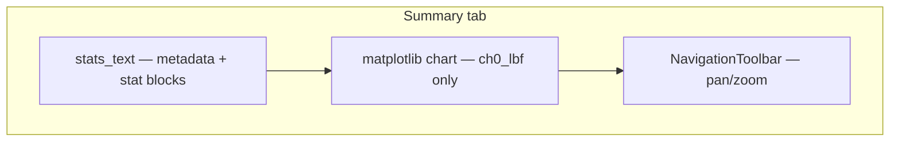
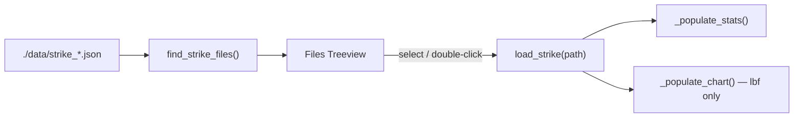

# HMI Tab Rework

Two related UI changes in [`hmi.py`](d:\Projects\Stabby\Stabatha\hmi.py) and [`file_access.py`](d:\Projects\Stabby\Stabatha\file_access.py):

1. **Files tab** — new column layout
2. **Summary + Chart** — merge into one tab; chart shows lbf only

Final tab order: **Record → Calibrate → Files → Summary** (Chart tab removed).

---

## Part 1: Files tab columns

### Current state

The Files tab Treeview has 9 columns including filename, samples, KB, and last modified:

```765:779:d:\Projects\Stabby\Stabatha\hmi.py
        cols = ("filename", "event", "name", "weapon_type",
                "peak_force_lbf", "impulse", "sample_count", "size_kb", "modified")
```

Row data comes from [`find_strike_files()`](d:\Projects\Stabby\Stabatha\file_access.py), which already exposes `feedback` but not `notes`.

### Target column layout

| Column ID | Header | Source |
|-----------|--------|--------|
| `id` | ID | Parsed from filename (`strike_YYYYMMDD_HHMMSS.json` → `YYYY-MM-DD HH:MM:SS`) |
| `event` | Event | JSON metadata |
| `name` | Name | JSON metadata |
| `weapon_type` | Weapon Type | JSON metadata |
| `peak_force_lbf` | Peak (lbf) | JSON metadata |
| `impulse` | Impulse | JSON metadata |
| `notes` | Notes | `strike.notes` |
| `feedback` | Cal Feedback | `strike.user_calibration_feedback` (blank if unset) |

**Removed:** `filename`, `sample_count`, `size_kb`, `modified`

File identity stays in Treeview `tags` (`meta["path"]`).

### Implementation — `file_access.py`

Add helper:

```python
def strike_id_from_filename(path: Path) -> str:
    try:
        dt = datetime.strptime(path.stem[7:], "%Y%m%d_%H%M%S")  # skip "strike_"
        return dt.strftime("%Y-%m-%d %H:%M:%S")
    except ValueError:
        return ""
```

Update `find_strike_files()`:
- Add `"id"` and `"notes"`
- Keep `"feedback"`
- Drop `filename`, `sample_count`, `size_kb`, `modified` and related `stat`/`mtime` work
- Sort glob results by filename-derived datetime (newest first)

### Implementation — Files tab in `hmi.py`

In `_build_files_tab()` (~765–799):
- Replace column defs with the 8 target columns
- Suggested widths: ID 155, Event/Name/Weapon 110, Peak/Impulse 80, Notes 180, Cal Feedback 90
- Default sort: `_files_sort_col = "id"`, `_files_sort_rev = True`

In `_files_sort()` and `refresh_file_list()` (~820–1239):
- Update `key_map` and `insert(..., values=...)` for new columns
- Remove old column keys

---

## Part 2: Merge Summary + Chart tabs

### Current state

Today there are two separate tabs:

- **Summary** (`_build_stats_panel`, ~864–882): scrollable `stats_text` with metadata, V/V and lbf stat blocks, capture info
- **Chart** (`_build_chart_panel`, ~888–904): optional tab (if `HAS_MPL`) with a **Show:** combobox (`V/V (raw)` / `lbf (if calibrated)`), Redraw button, and matplotlib plot

`_populate_chart()` (~1345–1382) switches column based on `_chart_mode`. File double-click switches to the Summary tab (~852–858).

### Target layout

Single **Summary** tab with vertical split:



- **Top:** existing summary text (unchanged content — still shows V/V and lbf stat blocks in text)
- **Bottom:** chart always plots `ch0_lbf` vs sample index (orange line, y-axis "lbf")
- **Removed:** separate Chart tab, `Show:` combobox, `_chart_mode` StringVar, Redraw button
- **Kept:** matplotlib navigation toolbar (pan/zoom/home)

When `HAS_MPL` is False, Summary tab shows stats text only (same as today without Chart tab).

### Implementation — tab registration (`_build_right_panel`, ~288–301)

Remove the conditional second tab:

```python
if HAS_MPL:
    tab = ttk.Frame(self.notebook)
    self.notebook.add(tab, text="  📈 Chart  ")
    self._build_chart_panel(tab)
```

Instead, embed chart setup inside `_build_stats_panel()`.

### Implementation — `_build_stats_panel()`

Refactor to build both sections in one parent:

1. Use a vertical `ttk.PanedWindow` (or top frame + bottom frame) so the user can resize stats vs chart
2. **Top pane:** existing `stats_text` + scrollbar (give text widget a reasonable default height, e.g. `height=16`, so chart gets space)
3. **Bottom pane (if `HAS_MPL`):** move figure/canvas/toolbar setup from `_build_chart_panel()` here — **without** the control bar (combobox + Redraw)
4. Delete `_build_chart_panel()` (or fold entirely into `_build_stats_panel`)

### Implementation — `_populate_chart()`

Simplify to always use lbf:

- `col = "ch0_lbf"`, `colour = ORANGE`, `ylabel = "lbf"`
- Remove `_chart_mode` / `use_lbf` branching
- Keep empty-state message when `ch0_lbf` column missing (uncalibrated strikes)

Remove `_redraw_chart()` and `_chart_mode` — no longer needed.

### Unchanged behavior

- `_on_file_select()` still calls `_populate_stats()` and `_populate_chart()` when a file is selected
- `_files_open_selected()` double-click still switches to Summary tab (no Chart tab to target)
- Summary text metadata blocks stay as-is

---

## Data flow



## Verification

**Files tab**
1. 8 columns in target order; ID matches filename timestamp
2. Notes and Cal Feedback populated from JSON
3. Column header sorting works; default sort is newest ID first
4. Select, Edit Metadata, Delete, double-click all work

**Summary tab**
1. Only one viewer tab (no separate Chart tab)
2. Selecting a strike shows metadata/stats at top and lbf chart below
3. No dataset dropdown or Redraw button
4. Chart toolbar still works for pan/zoom
5. Double-click in Files tab switches to Summary and shows both sections
